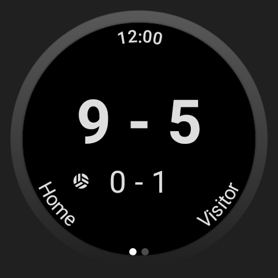
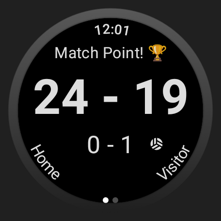

# Volleyball Score for Wear OS

A simple Wear OS application to keep track of the score during Volleyball matches. Built using Jetpack Compose.

> [!NOTE]
> In case you are looking at this application as an example, keep in mind that I do not usually write Kotlin or develop Android/Wear OS applications, so this project probably fails to follow best practices in both subjects.

> [!NOTE]
> I wrote this application mainly focussing on my Galaxy Watch 4. If you are trying to use it in a different shape/model/brand watch, visual and function issues may occur.

## Showcase Images

